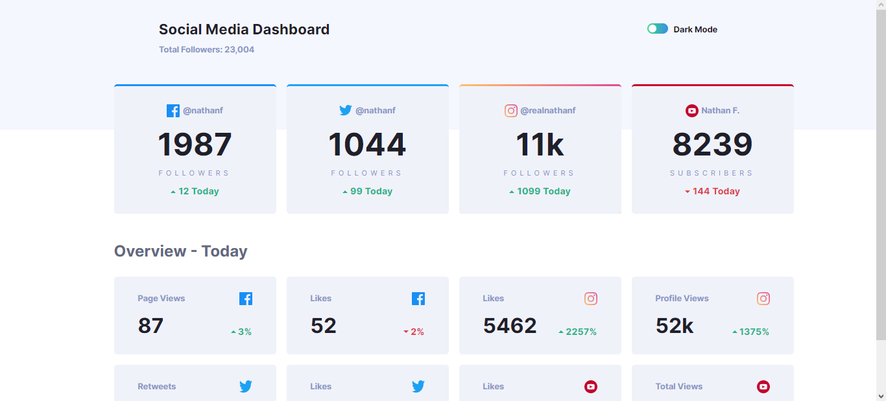

# Frontend Mentor - Social media dashboard with theme switcher solution

This is a solution to the [Social media dashboard with theme switcher challenge on Frontend Mentor](https://www.frontendmentor.io/challenges/social-media-dashboard-with-theme-switcher-6oY8ozp_H). Build with HTML, CSS, JS and Bootstrap (for the toggle).

## Overview

### The challenge

Users should be able to:

- View the optimal layout for the site depending on their device's screen size
- See hover states for all interactive elements on the page
- Toggle color theme to their preference

### Screenshots

## My process

### What I learned

WiWith this project I learned how to change values ​​of CSS variables via JavaScript in addition to practicing concepts such as responsiveness and Grid layouts.

### Built with

- HTML, CSS and JS
- Flexbox
- CSS Grid
- CSS Media Queries
- Bootstrap (for the toggle)
